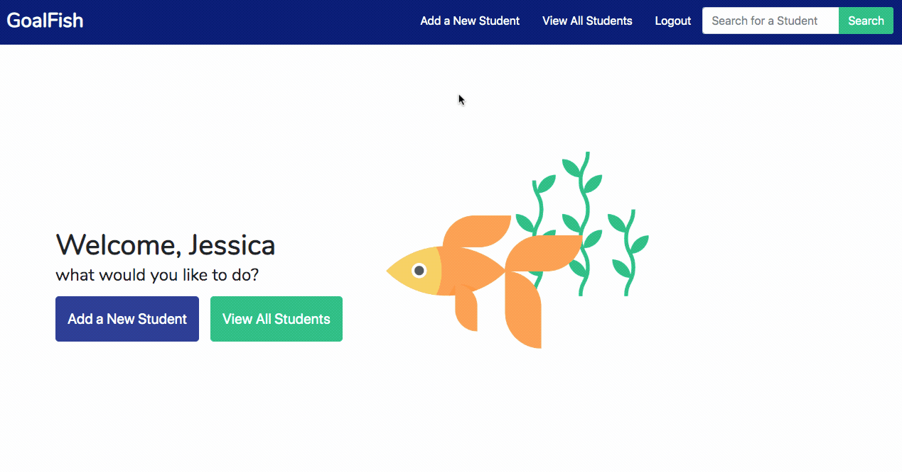
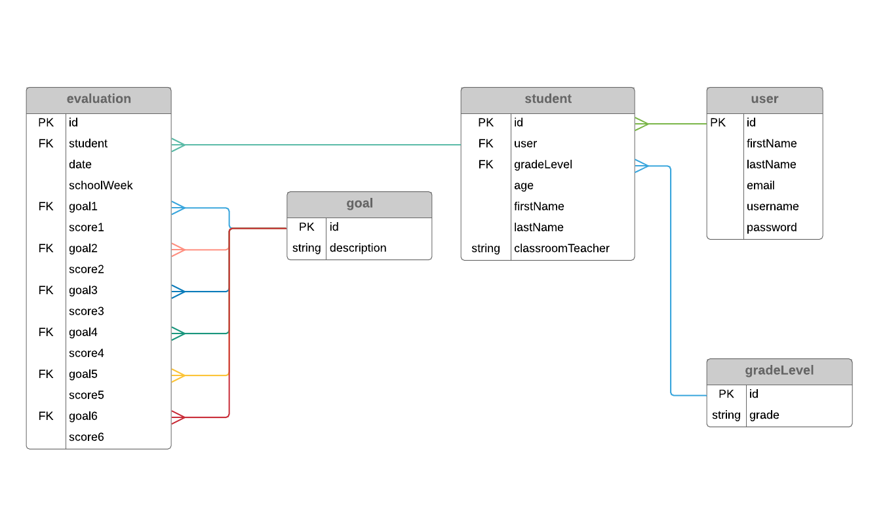

# Welcome to GoalFish

A Python Django web app that allows a teacher to track a students’ daily behavior goal scores and view their progress over time

## Background 

My friend is a special education teacher, and tracking a student’s behavior goals is a key part of her job. This data helps her to plan lessons and communicate with parents about their child’s progress. Because she doesn’t have software designed for this, she records scores on paper and uses a calculator for averaging. I built an app that allows her to input scores, calculate averages automatically, and output the student's scores in a table. This saves her hours of time and allows her to easily visualize a student's progress.

## General Functionality

The following functionalities are part of GoalFish:
* User registration (forked from Steve Brownlee and Joe Shepherd of Nashville Software School)
* User login (also forked from Steve and Joe)
* User logout (also forked from Steve and Joe)
* Students: add, edit, list, detail
* Evaluations: add, delete, detail
* Progress: view one week or a range of weeks

## App Flow
### This app has 4 goals:
1. Maintain a list of all the students the teacher is working with including their name, grade and age (a special education teacher works with students from multiple classrooms and grades)
2. Record daily evaluations for a student which involves giving a student a score for each of 6 goals per day
3. View a table of student’s scores for each goal one week at a time and their average for that week 
4. View a student’s scores for each goal in a range of weeks which includes the weekly average for each of the included weeks and an overall average for all weeks in that range

### Typical flow:
1. If it’s your first time in the app, add all your students. One of five random avatars will be associated with the student when they are created
2. If your students are already in the app, find the student you need to add an evaluation for or view progress for by:
..* entering their first name, last name, or full name in the search bar in the top right corner
..* clicking ‘view all students’ and use the search bar there or filter by grade to narrow the students down
3. Add an evaluation for a student by clicking on their ‘add evaluation’ button from the ‘view all students’ screen, or that student’s detail screen
4. View a student’s progress on goals from their detail screen by clicking on ‘view progress’
5. On the progress screen, view their progress for one week at a time or for a range of weeks using the drop-down forms 

## FYI
The entire app is only accessible to logged in users. A user can only view the students and the associated data for the students that they created.

**A note about dates and school weeks:** Each time a user records a new evaluation they will need to choose the date of the evaluation a school week to associate it with. These dates and school weeks are independent of each other, and it is at the discretion of the user to select them. In talking to my teacher friend, I made the decision to leave this up to the user for now, because the teacher always knows what week out of the school calendar they are in. The plan is to include an automatic association with the school week in version 2. Right now the dates are used as a reference for the user and to distinguish from one evaluation to the next. The school week is used for tracking progress and displaying evaluations on the table by week. 

## ERD

## To Clone
1. Create a directory
2. cd into that directory
3. Clone the repository
4. Start a virtual environment
5. run `pip install django`
6. Create migrations python manage.py makemigrations goalfish
7. Apply migrations to db `python manage.py migrate`
8. Open your database browser tool (such as DB Browser) and execute scripts found in the `starter_data.sql` file. This will populate the app with goals, grade levels and avatars
9. run `python manage.py runserver`
10. Open up your browser and navigate to the running server
11. Register and then start adding students and evaluations!

